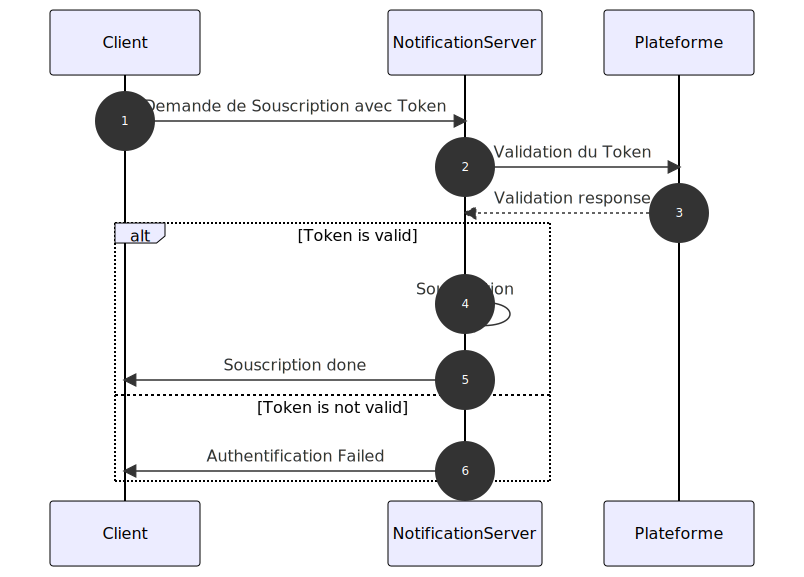

# DESCRIPTION
Cette réalisation consiste à mettre en place un serveur de notification en langage C, adoptant le modèle Publish-Subscribe (PubSub) comme fondement de son fonctionnement, tout en utilisant les WebSockets comme protocole de communication.

## Architecture du Serveur 
Le serveur de notification comprend les composants suivants :
### Producers
Les producteurs (publishers) sont des entités qui publient des messages vers le serveur. Ils envoient des messages sur des topics spécifiques. Les producteurs peuvent être des applications, des services ou des dispositifs qui génèrent des données à publier. Dans notre cas il s'agira par exemple de la plateforme.

### Consumers
Les consommateurs (subscribers) sont des entités qui s'abonnent à des topics spécifiques pour recevoir des messages. Ils peuvent être des applications ou des services qui ont besoin de traiter ou d'analyser les données publiées par les producteurs. 

### Topics
Les topics sont des canaux de communication thématiques auxquels les producteurs envoient des messages et auxquels les consommateurs s'abonnent pour recevoir des messages pertinents. Ils permettent de catégoriser les messages en fonction de leur contenu ou de leur destination.

### Messages
Les messages sont les unités de données publiées par les producteurs et consommées par les consommateurs. Chaque message est associé à un topic spécifique.

### Server
Le serveur constitue le cœur du système de notification. Il est responsable de la gestion des topics et messages, de la communication avec les Producers et les Consumers  pour la distribution des messages aux consommateurs appropriés. Il se base sur le protocole WebSockets à l'aide de `libwebsockets`.

### Schéma de l'Architecture du Serveur 

## Authentification 
### Consumers
Pour mettre en place l'authentification des clients web qui se connectent au serveur de notification, nous allons suivre ce pincipe:
- **Demande de Souscription avec Token** : Lorsqu'un client web souhaite s'abonner à un topic  sur le serveur de notification, il inclut son token d'accès que lui a fourni la plateforme dans la demande d'abonnement.

- **Validation du Token** : Le serveur de notification reçoit la demande d'abonnement avec le token d'accès. Il effectue ensuite une vérification de ce token pour s'assurer de son authenticité Pour valider le token, le serveur de notification fait appel à un endpoint de la plateoforme, en lui transmettant le token pour vérification. Si le token est valide, la backend répond positivement. Sinon, elle répond avec une erreur d'authentification.

- **Réponse au Client** : En fonction de la réponse, le serveur de notification procède comme suit :
    * Si le token est valide, le serveur de notification effectue la souscription au topic demandé par le client.
    * Si le token n'est pas valide, le serveur de notification renvoie une réponse d'erreur au client, indiquant que l'authentification a échoué.

Cette approche garantit que seuls les clients authentifiés et autorisés peuvent s'abonner aux topics sur le serveur de notification, en utilisant des tokens d'accès valides.

### Diagramme de l'Authentification

### Producers
L'authentification des producers suit un principe similaire à celui des consommateurs.
L'application qui instancie le producer, peux demander et obtenir et token au près de la plateforme.
Lors de l'initialisation d'un client producteur, l'application envoie le token d'accès qui est ensuite validé auprès de la plateforme. Si le token est valide, le serveur de notification peut alors consommer les messages venant de ce producer vers le topic associé. Sinon les messages sont rejétés. 

## Mode de Notification
Les modes de notification seront ***Pull*** ou ***Push***. Lors de la souscription, le client choisit le type de mode. Étant donné que nous allons utiliser les WebSockets, le mode Push sera celui par défaut.

### Push
En mode ***Push***, le serveur de notification envoie automatiquement les nouveaux messages aux clients dès qu'ils sont disponibles. Les clients n'ont pas besoin de demander les messages, ce qui permet une réception instantanée des notifications.

### Pull
En mode ***Pull***, les clients doivent périodiquement interroger le serveur de notification pour récupérer les nouveaux messages. Le serveur ne pousse pas les messages automatiquement ; au lieu de cela, les clients effectuent des requêtes pour obtenir les mises à jour. 

## Stockage des Messages
TODO